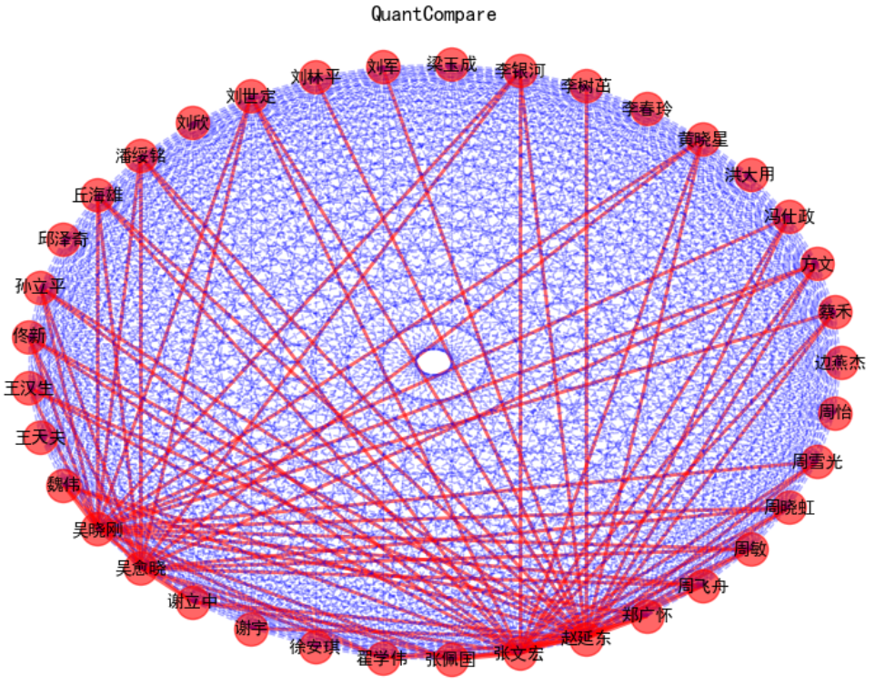

###  SHU SNA lab work3

#### Rely on

**python**

* python ver 3.0 or newer version
* pandas
* networkx
* matplotlib 

>  **How to Install** 

​       Open your cmd  terminal type cmd

​	`		pip3 install --user  -i https://pypi.tuna.tsinghua.edu.cn/simple    *packgename*`

​	For example networkx 

​	`	pip3 install --user  -i https://pypi.tuna.tsinghua.edu.cn/simple    networkx`

**R**

Installation steps refer to Google

### How to use

* ##### First step

  Extract all node info from rds file  to a readable csv 

  run this cmd in your cmd terminal:

  `Rscript.exe   rds_Process.R`

  will generate  `Source_data.csv`  file which will used by python 

  

* ##### Second Step

  `python  GenarteGraph.py`

​       The script will process all node informations  which get from`Source_data.csv`   to generate Graph data      frame saved as `after_process.csv` and draw net graph figure by networkx.

#### The Example Figure:

​        

